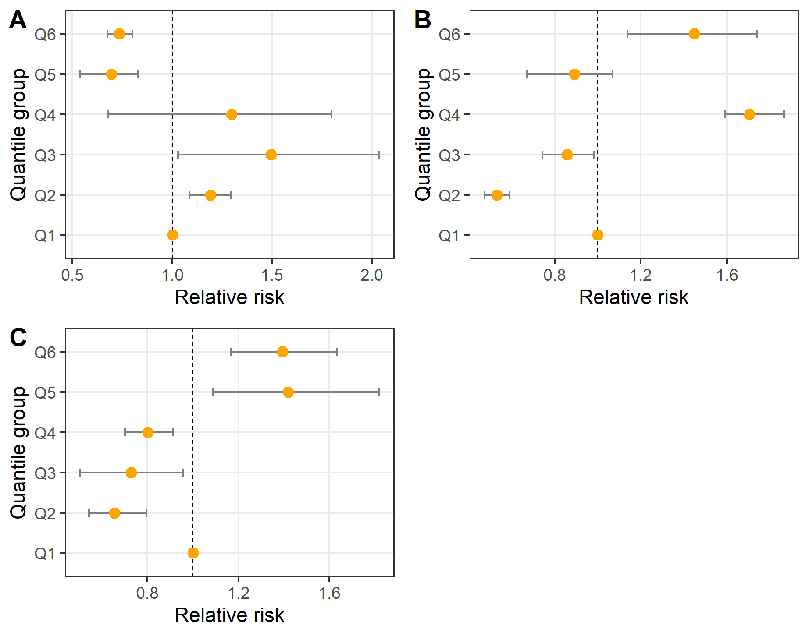

---
---
---

# MCDA (multicriteria decision analysis) validation using serological (serosurveillance data)

Case study: PPR (peste-des-petits ruminants) in three states Bauchi, Kano and Plateau in Nigeria

What is the predictive value of the MCDA index for infection risk with PPR? Can high deciles (above the median) of the MCDA index be used to focus PPR surveillance on these regions?

Step 1: Getting the MCDA index results and sero-prevalence data. Seroprevalence by local government, LGAs (in the form m positive animals among n sampled). In our case young animals less than 1 year old to indicate recent PPR infection.

Step 2: Getting the quantiles and relative risk of the estimates

Calculation of relative risks RRiRR_iRRi associated with the intervals between deciles of this MCDA index located above the median. Seroprevalence in the interval between the minimum and the median of MCDA is taken as the common denominator of RRiRR_iRRi.

Calculation of quantiles 0% (min), 50% (median), 60%, 70%,..., 100% (max) = limits of the MCDA index classes. For each class iii (50-60%,..., 90-100%), calculate the average seroprevalence PiP_iPi of municipalities in this class Calculate RRi=Pi/P0−50%RR_i = P_i / P\_{0-50%}RRi=Pi/P0−50%.

```         
# Define quantile intervals in the estimate data set
state$quantile <- with(state, 
                       factor(
                         findInterval(risk, 
                                      c(quantile(risk, 
                                                 probs=probabilites))),
                         labels=quantiles_labels),
                       )
                       
# For each class $i$ (50-60%,..., 90-100%), calculate the average 
# seroprevalences $P_i$ of the communes in this class
state_av_class <- aggregate(aver_sero~quantile, data=state, mean)

# Calculate $RR_i = P_i / P_{0-50\%}$
state_av_class$rr <- with(state_av_class,aver_sero/aver_sero[quantile == 'Q1'])
                       
```

Step 3: Bootstrap for confidence intervals

3.1 Draw 1000 times, with replacement, a pseudo-sample of municipalities, of the same size as the initial sample.

```         
# Draw pseudo-samples of communes, with replacement, of the same size 
# as the initial sample
state_boot <- state_no_na |>
  specify(response = NAME_2)|>
  generate(reps = 1000, type = "bootstrap")
```

3.2 Re-calculate the RRiRR_iRRi for each pseudo-sample. CI bounds: 25% and 75% quantiles of each series of 1000 RRiRR_iRRi values.

```         
# Loop rows by replicate groups
for (replicate_group in unique(state_boot$replicate)) {
  # Filter data set by group
  df_filter <- state_boot[state_boot$replicate == replicate_group,]
  # Add quantile intervals to the filtered group data frame
  df_filter$quantile <- with(df_filter, 
                             factor(findInterval( risk, c(quantile(risk, 
                                                             probs=probabilites))),
                                    ))
  # Relabel dynamically, since levels are not fixed due to bootstrap random strata
  df_filter$quantile <- as.character(lapply(df_filter$quantile, 
                                            function(x) quantiles_labels[as.numeric(x)]))

  #Left join the original data frame with the filtered data frame
  # containing the calculated quantile
  state_boot <- merge(state_boot,df_filter[,c("quantile","ID")],by="ID",all.x = TRUE)


  # Fill NA values and remove extra columns. 
  # Performed only if the number of strata is >= 2 
  if ("quantile.x" %in% colnames(state_boot)) {
    # Unite fields after left join
    state_boot$quantile <- ifelse(is.na(state_boot$quantile.x),
                                   state_boot$quantile.y, 
                                   state_boot$quantile.x )
    # Remove .x and .y columns created after left-join
    state_boot <- state_boot %>% 
      select(-ends_with(c(".x", ".y")))
  }

}

# Re-calculate the $RR_i$ for each pseudo-sample
state_boot_av_class <- aggregate(aver_sero ~ replicate + quantile, data=state_boot, mean)

state_boot_av_class <- state_boot_av_class %>%
  group_by(replicate) %>%
  mutate(rr = aver_sero/aver_sero[quantile == 'Q1'])

# Calculate mean, upper and lower RR in the pseudo-sample data set
state_boot_ci <- 
  state_boot_av_class %>% 
  group_by(quantile) %>% 
  summarize(
    mean = mean(rr),
    lower = quantile(rr, probs = 0.25),  # 50% bootstrap CI
    upper = quantile(rr, probs = 0.75)
  )
  
  # Produce a summary table of the mean, upper and lower RR
state_final_df <- merge(state_boot_ci,state_av_class,by="quantile",all.x = TRUE)
```

Figure: Relative risk per quantile based on the estimated data and the pseudo-sampled data set in the 3 Nigerian states A. Bauchi, B. Kano and C. Plateau


